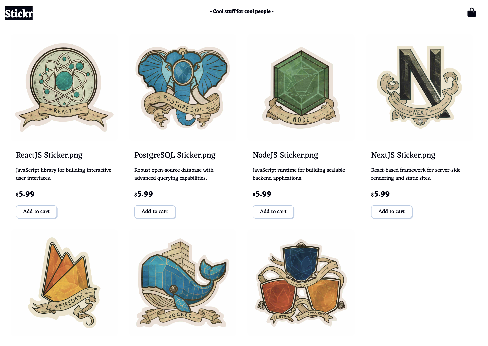
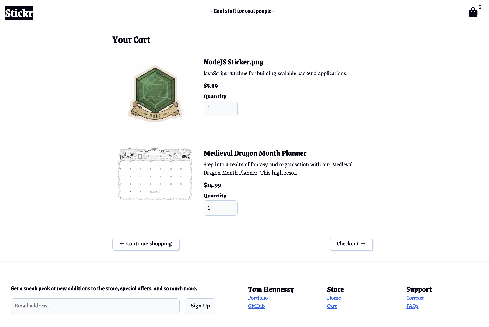
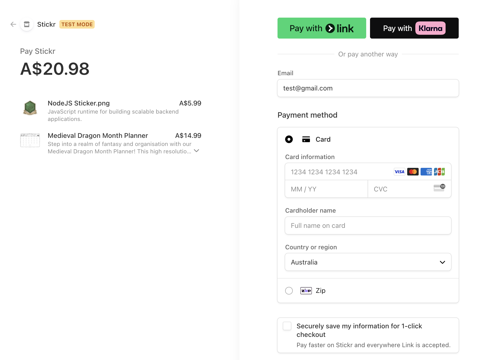

# Stickr – E-Commerce Store 🛒

A full-stack online store with product listings, a shopping cart, and secure Stripe checkout.

Built to explore product flows, payments, and AWS Amplify deployment.

---

## 🔗 Live Demo

**🛍️** [Live App (AWS Amplify)](https://main.d1cxwz0h5a8ec4.amplifyapp.com)
**💻** [GitHub Repo](https://github.com/tomlhennessy/stickr)

---

## 🧰 Tech Stack

- **Frontend:** React · Next.js (App Router)
- **Backend:** Serverless API via Next.js
- **Payments:** Stripe (secure checkout flow)
- **Deployment:** AWS Amplify
- **Styling:** TailwindCSS

---

## 🚀 Features

- 🛒 Browse products and add to cart
- 🧾 Stripe checkout integration
- 📦 Order summary + redirect
- 💳 Live Stripe test mode
- 🖼️ Optimised layout for all screen sizes

---

## 🧠 What I Learned

- Handling cart logic with global state (React context)
- Creating secure payment flows using Stripe's SDK
- Deploying with AWS Amplify (builds + domain config)
- Designing for UX in an e-commerce setting

---

## 📸 Screenshots

| Product Grid | Cart | Checkout |
|-------------|------|----------|
|  |  |  |
